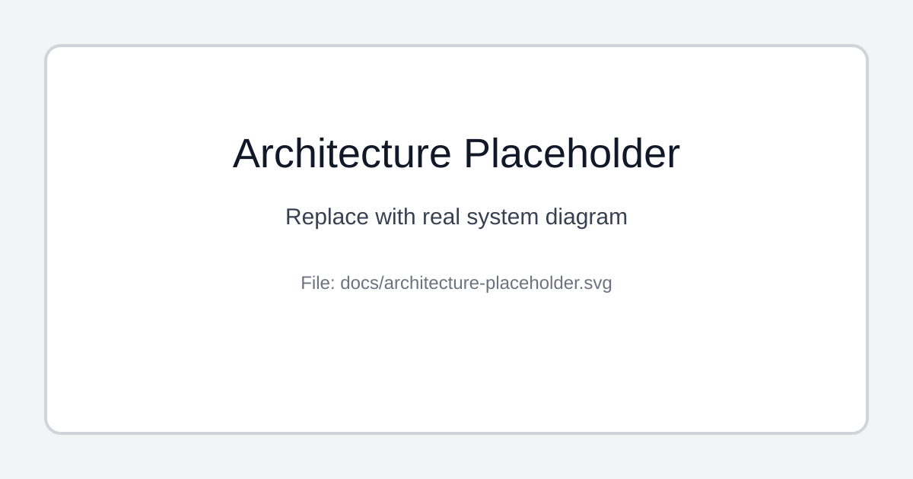

# highway-network

<p align="center">
  
  
</p>

<p align="center">
  highway-network is a concurrent highway toll-network simulator in C, designed as an operating-systems project focused on process coordination, IPC, synchronization, and reliable vehicle-flow tracking.
</p>

<p align="center">
  
  
  
  
  
  
  
  
  
  
  
</p>

---

## 🎬 Product Overview

[](docs/architecture-placeholder.svg)

---

## 🔗 Links

- Main Repo: https://github.com/dhunanyan/highway-network
- Issues: https://github.com/dhunanyan/highway-network/issues
- Pull Requests: https://github.com/dhunanyan/highway-network/pulls
- Releases: https://github.com/dhunanyan/highway-network/releases

---

## 📦 Modules Overview

| Module (planned) | Category | Responsibility |
| ---------------- | -------- | -------------- |
| `gate-entry` | Simulation Core | Registers vehicle entry events and timestamps. |
| `gate-exit` | Simulation Core | Registers vehicle exits and finalizes trip state. |
| `vehicle-registry` | Shared State | Tracks active vehicles still on the network. |
| `toll-engine` | Business Logic | Computes distance-based tolls and fees. |
| `ipc-bus` | IPC Layer | Message passing via pipes and/or message queues. |
| `sync-layer` | Synchronization | Guards shared state with semaphores/mutexes. |
| `controller` | Orchestration | Starts workers, handles lifecycle, signals, and shutdown. |
| `reporting` | Output | Emits snapshots, summaries, and diagnostics. |

---

## 🧭 Repo Structure

| Path | Purpose |
| ---- | ------- |
| `.github/*` | Community health files, issue/PR templates, policies |
| `docs/*` | Architecture diagrams, sequence flows, media assets |
| `src/*` | Source modules for simulation and orchestration |
| `include/*` | Header files and shared interfaces |
| `tests/*` | Integration and concurrency validation scenarios |

---

## 🚀 Getting Started

```bash
git clone https://github.com/dhunanyan/highway-network.git
cd highway-network
```

### Build

```bash
make
```

### Run (planned entrypoint)

```bash
./build/highway-network
```

### Clean

```bash
make clean
```

---

## 🧪 Concurrency Scope

- Processes (`fork`, `waitpid`)
- Threads (`pthread`)
- Pipes (duplex communication)
- Message queues (typed async messages)
- Shared memory (common state segment)
- Semaphores (cross-process synchronization)
- Signals (control and lifecycle events)

---

## 🌐 Docs & Demos

- Architecture diagram placeholder: `docs/architecture-placeholder.svg`
- Event-flow sequence placeholder: `docs/sequence-placeholder.svg`

---

## 📦 Releases

- Initial release process will be introduced after the first stable simulation milestone.
- Semantic versioning is planned for public milestones.

---

## 🤝 Contributing

See `CONTRIBUTING.md` and `CODE_OF_CONDUCT.md` for guidelines.

---

## 🔐 Security

Report vulnerabilities via `SECURITY.md`.

---

## 📝 License

License file will be added before first public stable release.
