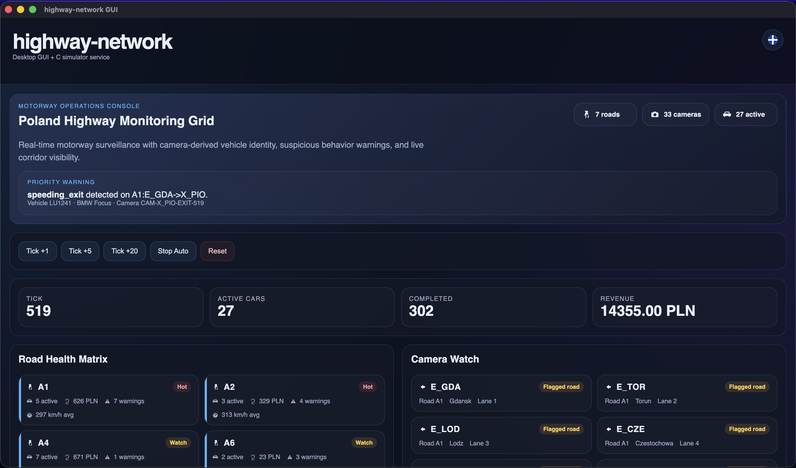
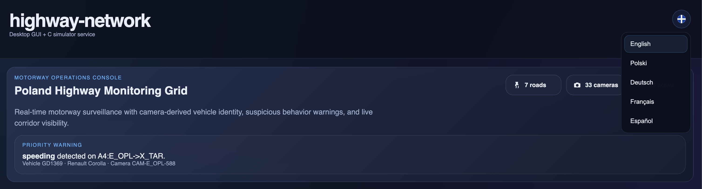
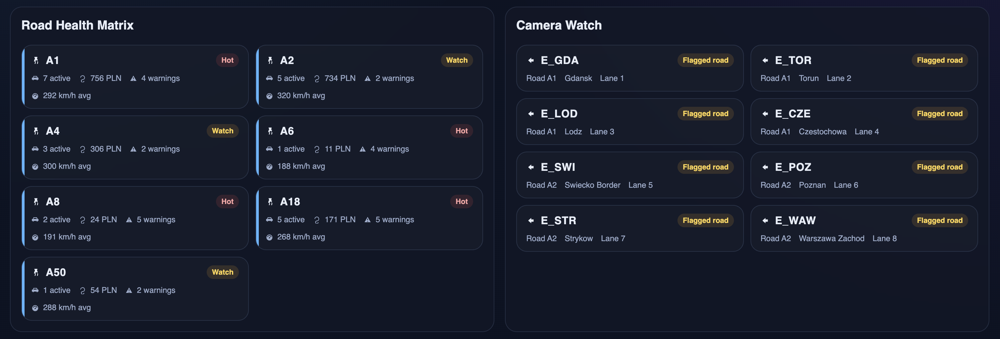
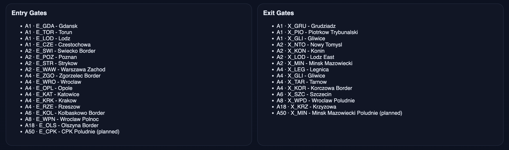
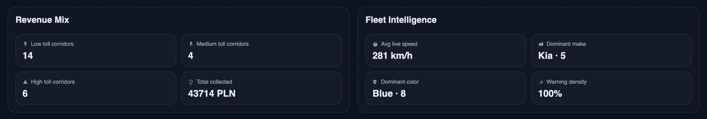
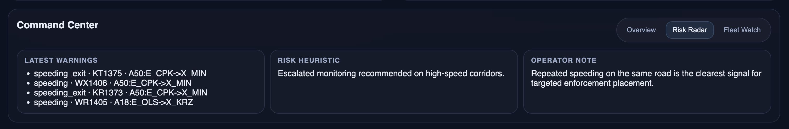
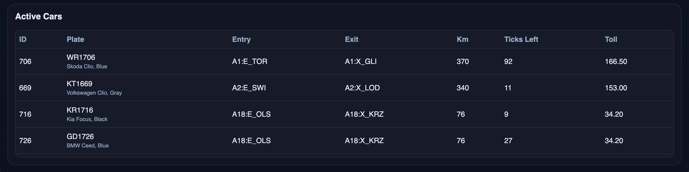
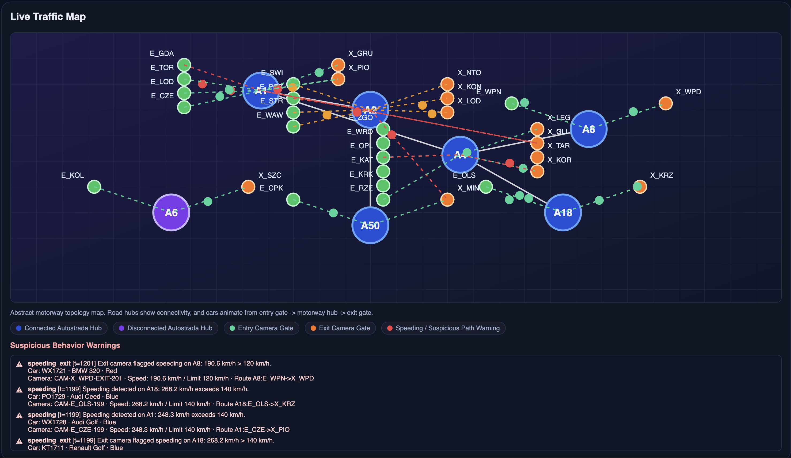
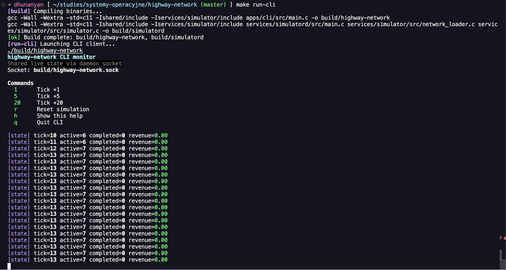

# GUI

Ta sekcja opisuje desktopową aplikację GUI z punktu widzenia zwykłego użytkownika, który chce uruchomić program, zrozumieć co pokazuje interfejs oraz bezpiecznie i poprawnie korzystać z symulacji.

## Czym jest GUI

GUI jest desktopowym klientem Electron, który łączy się z demonem symulatora autostrad i wizualizuje aktualny stan sieci drogowej. GUI nie jest samym symulatorem. Symulatorem jest proces-demon napisany w C, który przechowuje autorytatywny, współdzielony stan aplikacji. GUI jest panelem sterowania i monitoringu działającym na tym stanie.

W praktyce oznacza to, że:

- GUI wyświetla dane na żywo pochodzące z demona symulatora.
- GUI może wysyłać komendy takie jak `TICK 1`, `TICK 5`, `TICK 20` oraz `RESET`.
- GUI nie utrzymuje własnej, niezależnej kopii symulacji.
- Jeżeli równolegle uruchomiony jest klient CLI, to GUI i CLI obserwują dokładnie ten sam stan symulacji.

To jest najważniejsza rzecz, którą końcowy użytkownik powinien zrozumieć. Istnieje jeden współdzielony stan symulacji, a wiele klientów może się do niego podłączać.

## Co jest potrzebne przed uruchomieniem

Aby wygodnie korzystać z GUI, najpierw upewnij się, że projekt został zbudowany.

```bash
make build
```

Po tym możesz uruchomić GUI na dwa sposoby.

### Standardowy, jawny sposób uruchamiania

To najbardziej przejrzysty i najbezpieczniejszy workflow.

Terminal 1:

```bash
make run-simulator
```

Terminal 2:

```bash
make run-gui
```

### Uruchomienie od GUI

Możesz również uruchomić GUI bez ręcznego uruchamiania demona:

```bash
make run-gui
```

Jeżeli GUI wykryje, że demon symulatora nie jest już uruchomiony, spróbuje uruchomić go automatycznie w tle. Jest to wygodne, ale do debugowania i demonstracji na zajęciach zwykle lepsze jest jawne uruchomienie w dwóch terminalach, ponieważ wtedy od razu widać cykl życia demona.

## Zalecany sposób uruchamiania całego projektu

Dla pełnej widoczności, szczególnie jeśli chcesz mieć też monitoring terminalowy, zalecany układ jest następujący:

Terminal 1:

```bash
make run-simulator
```

Terminal 2:

```bash
make run-cli
```

Terminal 3:

```bash
make run-gui
```

W takim układzie:

- demon symulatora przechowuje stan źródłowy,
- CLI daje szybki monitoring i sterowanie w terminalu,
- GUI daje bogaty monitoring wizualny oraz interaktywne sterowanie.

## Co dzieje się po otwarciu GUI

Po otwarciu okna GUI od razu dzieje się kilka rzeczy:

- aplikacja próbuje połączyć się z gniazdem UNIX pod ścieżką `build/highway-network.sock`,
- jeżeli demon jest dostępny, GUI zaczyna pobierać aktualny stan,
- GUI odświeża widok co 800 ms,
- aktualnie wybrany język jest przywracany z local storage, jeśli wcześniej był zmieniany.

Samo okno GUI jest dashboardem monitorującym, a nie kreatorem krok po kroku. Oznacza to, że prawie wszystko jest widoczne od razu na jednej stronie.



## Główny układ GUI

GUI jest zorganizowane jako jeden ciągły dashboard. Główne obszary to:

- nagłówek,
- przełącznik języka,
- panel hero / overview,
- przyciski sterujące,
- cztery główne metryki,
- sekcja stanu dróg,
- sekcja podglądu kamer,
- sekcja struktury opłat,
- sekcja analizy floty,
- zakładki centrum dowodzenia,
- sekcja bramek wjazdowych,
- sekcja bramek zjazdowych,
- tabela aktywnych aut,
- mapa ruchu na żywo,
- lista ostrzeżeń o podejrzanych zachowaniach.

Kolejne podsekcje opisują każdy z tych elementów szczegółowo.

## Nagłówek

Nagłówek zawiera:

- nazwę aplikacji `highway-network`,
- krótki podpis informujący, że jest to desktopowe GUI działające z usługą symulatora w C,
- obszar statusu,
- przycisk przełącznika języka w prawym górnym rogu.

### Obszar statusu

Linia statusu jest szczególnie ważna wtedy, gdy coś działa niepoprawnie.

Domyślnie jest pusta.

Pojawia się w niej komunikat, kiedy:

- GUI nie może połączyć się z demonem,
- demon zwrócił payload z błędem,
- JSON zwrócony przez demona nie dał się sparsować,
- połączenie z gniazdem zakończyło się błędem.

Jeżeli widzisz komunikat typu `Simulator error: daemon_connection_failed`, zwykle oznacza to jedną z poniższych sytuacji:

- demon symulatora nie jest uruchomiony,
- plik gniazda nie istnieje,
- demon się wyłączył,
- GUI wystartowało zanim demon był gotowy,
- GUI i demon wskazują różne ścieżki.

## Przełącznik języka

W prawym górnym rogu znajduje się mały okrągły przycisk z ikoną związaną z tłumaczeniami / językami. Ten przycisk otwiera menu wyboru języka.

### Obsługiwane języki

GUI obecnie posiada tłumaczenia dla:

- angielskiego,
- polskiego,
- niemieckiego,
- francuskiego,
- hiszpańskiego.

### Jak go używać

1. Kliknij przycisk języka.
2. Otworzy się rozwijane menu.
3. Kliknij wybrany język.
4. Całe GUI zostanie natychmiast przerysowane w tym języku.



### Co dokładnie jest tłumaczone

Warstwa tłumaczeń obejmuje wszystkie następujące elementy:

- tytuły sekcji,
- etykiety przycisków,
- nazwy zakładek,
- nagłówki tabel,
- podpis mapy,
- etykiety legendy,
- komunikaty pustych stanów,
- etykiety ostrzeżeń,
- etykiety w centrum dowodzenia,
- treść panelu hero,
- tekst spotlight / statusu operacyjnego.

### Zapamiętywanie wyboru

Wybrany język jest zapisywany lokalnie w storage używanym przez Electron. To znaczy, że:

- jeśli zamkniesz GUI,
- a potem otworzysz je później ponownie,
- GUI spróbuje automatycznie przywrócić ostatnio wybrany język.

### Ważna uwaga

Sama treść danych symulatora nie jest wielojęzyczna. Marki pojazdów, modele, identyfikatory bramek i surowe identyfikatory tras pozostają takie same. Tłumaczenie dotyczy interfejsu klienta i tekstów opisowych, a nie samych identyfikatorów symulacji.

## Panel hero / overview

Pierwszy duży blok dashboardu to panel hero. Działa jak kompaktowe podsumowanie operacyjne.

Zawiera:

- małą etykietę nagłówkową,
- tytuł sieci,
- krótki opis,
- trzy kompaktowe badge,
- kartę spotlight.

### Tytuł sieci

Aktualnie wyświetlana nazwa pochodzi z danych sieci zgłoszonych przez symulator. Załadowany plik CSV domyślnie używa w backendzie nazwy podobnej do `A2-A4 Local Network`, natomiast warstwa tłumaczeń GUI może prezentować bardziej przyjazny tytuł dla użytkownika końcowego.

### Badge 1: drogi

Ten badge pokazuje, ile różnych dróg znajduje się obecnie w załadowanym zbiorze danych.

W tej chwili dataset zawiera następujące korytarze autostradowe:

- A1,
- A2,
- A4,
- A6,
- A8,
- A18,
- A50.

Dlatego badge powinien normalnie pokazywać `7 dróg`, chyba że dataset zostanie zmieniony.

### Badge 2: kamery

Ten badge pokazuje łączną liczbę skonfigurowanych bramek wjazdowych i zjazdowych.

Z punktu widzenia użytkownika końcowego każda bramka zachowuje się jak monitorowany checkpoint. GUI nazywa je kamerami, ponieważ alerty i funkcje monitorujące traktują je jako punkty obserwacyjne.

### Badge 3: aktywne

Ten badge pokazuje liczbę aktualnie aktywnych aut w symulowanej sieci.

Ta liczba zmienia się stale, ponieważ:

- pojawiają się nowe auta,
- istniejące auta przesuwają się po trasach,
- zakończone przejazdy opuszczają zbiór aktywnych.

### Karta spotlight

Karta spotlight zmienia się w zależności od tego, czy istnieją aktywne alerty.

Jeżeli istnieje przynajmniej jeden świeży alert:

- karta staje się obszarem ostrzeżenia priorytetowego,
- podświetla najnowszy alert,
- zawiera trasę oraz dane identyfikacyjne pojazdu.

Jeżeli nie ma bieżących alertów:

- karta pokazuje stabilny status operacyjny,
- działa jako spokojne podsumowanie sytuacji.

To dobre miejsce, jeśli chcesz jednym spojrzeniem ocenić ogólny stan systemu przed czytaniem szczegółowych sekcji niżej.

## Przyciski sterujące

Pod panelem hero znajduje się rząd przycisków sterujących.

To są podstawowe interaktywne kontrolki GUI.

### `Tick +1`

Wysyła do demona jeden krok symulacji.

### `Tick +5`

Wysyła do demona pięć kroków symulacji w jednej komendzie.

### `Tick +20`

Wysyła do demona dwadzieścia kroków symulacji w jednej komendzie.

To najszybszy ręczny sposób, aby wyraźnie przesunąć symulację do przodu.

### `Start Auto`

Uruchamia automatyczne tikowanie.

Po włączeniu:

- etykieta przycisku zmienia się na `Stop Auto`,
- GUI automatycznie wysyła `TICK 1` co 700 ms.

To funkcja automatyzacji po stronie klienta. Nie oznacza to, że demon sam staje się autonomiczny. To GUI wielokrotnie prosi demona o przesunięcie świata o jeden tick.

### `Reset`

Resetuje stan symulacji w demonie.

Reset czyści i uruchamia od nowa:

- licznik ticków,
- aktywne przejazdy,
- licznik zakończonych przejazdów,
- skumulowany przychód,
- alerty,
- sekwencję kolejnych ID przejazdów.

Nie usuwa to definicji sieci. Topologia dróg i bramek pozostaje nadal załadowana z pliku CSV.

## Co oznacza tick

Tick to centralna jednostka czasu całej symulacji.

W implementacji backendowej:

- `1 tick = 30 symulowanych sekund`.

To jest bardzo ważne, ponieważ wiele wyświetlanych wartości jest od niego zależnych.

### Dlaczego tick ma znaczenie

Tick wpływa na:

- szybkość postępu aut po trasach,
- moment, w którym auto może wygenerować alert o przekroczeniu prędkości,
- moment, w którym auto może wygenerować alert typu lingering,
- moment finalizacji przychodu,
- tempo działania trybu `auto`.

### Czas rzeczywisty a czas symulowany

Nie należy mylić prędkości odświeżania GUI z czasem symulacji.

- interwał odświeżania GUI: 800 ms czasu rzeczywistego,
- interwał komendy auto: 700 ms czasu rzeczywistego,
- jeden tick symulacji: 30 sekund czasu symulowanego.

Oznacza to, że w trybie auto zegar symulacji może przesuwać się dużo szybciej niż czas rzeczywisty.

## Górny wiersz metryk

Następny rząd dashboardu pokazuje cztery kompaktowe metryki.

### Tick

To globalny numer bieżącego ticka symulacji.

Można go interpretować jako logiczny czas, który upłynął od ostatniego resetu.

Jeżeli tick ma wartość 10, to czas symulowany przesunął się o:

- `10 * 30 sekund = 300 sekund = 5 minut`.

### Aktywne auta

To liczba aktualnie aktywnych przejazdów.

Auto jest aktywne, jeżeli:

- zostało już wygenerowane,
- ale nie zakończyło jeszcze przejazdu.

### Zakończone

To liczba przejazdów, które zostały w pełni ukończone.

Zakończony przejazd to taki, którego `ticks_left` spadło do zera lub poniżej. Wtedy:

- przejazd zostaje usunięty ze zbioru aktywnych,
- licznik zakończonych wzrasta,
- oczekiwana opłata zostaje dodana do przychodu,
- może zostać wygenerowany końcowy alert związany z prędkością na wyjeździe.

### Przychód

To skumulowany przychód z ukończonych przejazdów.

Ważny szczegół:

- przychód jest dodawany dopiero po zakończeniu przejazdu,
- nie w trakcie jego trwania.

Czyli aktywne przejazdy wpływają na przyszły oczekiwany przychód, ale jeszcze nie na główną metrykę przychodu.

## Road Health Matrix / Stan dróg

Ta sekcja agreguje aktualny stan sieci według dróg.

Każda karta drogi podsumowuje jeden korytarz, np. A1 lub A4.

### Co zawiera każda karta drogi

Każda karta zawiera:

- identyfikator drogi,
- badge stanu,
- liczbę aktywnych aut na tej drodze,
- łączną wartość oczekiwanych opłat dla aktualnie aktywnych aut na tej drodze,
- liczbę ostrzeżeń dla tej drogi,
- średnią szacowaną prędkość aktywnych przejazdów na tej drodze.

### Znaczenie badge stanu

Badge jest wyznaczany na podstawie liczby ostrzeżeń.

- `Stable` / `Stabilnie` oznacza brak ostrzeżeń na tej drodze,
- `Watch` / `Obserwuj` oznacza przynajmniej jedno ostrzeżenie,
- `Hot` / `Gorąco` oznacza, że liczba ostrzeżeń przekroczyła wyższy próg używany przez GUI.

To jest podsumowanie w logice UI, a nie formalna kategoria egzekucji prawa.

### Jak wyliczana jest średnia prędkość

GUI szacuje prędkość na podstawie postępu symulacji, używając:

- długości trasy,
- całkowitej liczby ticków dla przejazdu,
- liczby ticków, które już minęły,
- definicji, że jeden tick to 30 symulowanych sekund.

### Ważna uwaga o realizmie

Obecna symulacja jest celowo uproszczona i nie jest jeszcze w pełni skalibrowana do realnych czasów przejazdów autostradowych. Ze względu na sposób generowania długości przejazdu, szacowane prędkości należy traktować raczej jako wynik modelu monitoringu niż ścisły fizyczny model ruchu drogowego.

To szczególnie ważne przy interpretacji gęstości ostrzeżeń i średnich prędkości. Wartości są spójne wewnętrznie dla symulacji, ale nie są jeszcze zestrojone jak pełny model inżynierii ruchu.



## Camera Watch / Podgląd kamer

Ta sekcja skupia się na monitorowanych bramkach.

Łączy punkty wejściowe i wyjściowe i przedstawia je jako checkpointy kamerowe.

### Co pokazuje każda karta

Każda karta pokazuje:

- typ kierunku bramki,
- ID bramki,
- informację, czy droga jest aktualnie oznaczona jako wymagająca uwagi lub czysta,
- kod drogi,
- nazwę bramki,
- prostą etykietę pasa wygenerowaną przez GUI.

### `Flagged road` vs `Clear feed`

Te etykiety są podsumowaniami na poziomie GUI.

Bramka jest uznawana za flagged w tej sekcji wtedy, gdy:

- istnieje przynajmniej jeden alert powiązany z tą samą drogą.

Nie oznacza to koniecznie, że konkretnie ta bramka wywołała alert. Oznacza to, że dany korytarz drogowy jest obecnie objęty wzmożoną uwagą.



## Revenue Mix / Struktura opłat

Ta sekcja grupuje aktualnie aktywne przejazdy do przedziałów opłat.

### Co oznaczają przedziały

Przedziały są oparte na oczekiwanej wartości opłaty dla aktywnych przejazdów.

- niski poziom opłaty,
- średni poziom opłaty,
- wysoki poziom opłaty,
- łączna kwota zebrana.

### Jak liczona jest opłata

Symulator używa prostego modelu:

- `price_per_km = 0.45 PLN`,
- `expected_toll = distance_km * price_per_km`.

Przykłady:

- 100 km -> 45.00 PLN,
- 200 km -> 90.00 PLN,
- 300 km -> 135.00 PLN.

### Co reprezentują etykiety bucketów

Przedziały GUI są oparte o progi opłat:

- poniżej 80 PLN,
- od 80 do 160 PLN,
- powyżej 160 PLN.

Ta sekcja jest przydatna, jeśli chcesz szybko zobaczyć, jak aktywny ruch rozkłada się ekonomicznie.



## Fleet Intelligence / Analiza floty

Ta sekcja podsumowuje skład aktywnej floty.

### Wyświetlane metryki

Panel pokazuje obecnie:

- średnią prędkość na żywo,
- dominującą markę,
- dominujący kolor,
- gęstość ostrzeżeń.

### Dominująca marka

To po prostu najczęściej występująca marka wśród aktywnych przejazdów.

Możliwe marki w aktualnej puli symulatora to:

- Toyota,
- Skoda,
- Volkswagen,
- BMW,
- Audi,
- Ford,
- Renault,
- Kia.

### Dominujący kolor

To najczęściej występujący kolor wśród aktywnych przejazdów.

Możliwe kolory w aktualnej puli symulatora to:

- White,
- Black,
- Silver,
- Blue,
- Red,
- Gray.

### Gęstość ostrzeżeń

To procent wyliczony po stronie GUI:

- liczba alertów podzielona przez liczbę aktywnych aut.

Jest to orientacyjny sygnał operacyjny, a nie naukowy współczynnik ryzyka.

## Command Center / Centrum dowodzenia

To sekcja analityczna z zakładkami.

Zawiera trzy zakładki:

- Overview,
- Risk Radar,
- Fleet Watch.

W danym momencie widoczna jest tylko jedna zakładka.

### Jak działają zakładki

Kliknięcie zakładki zmienia widoczną zawartość w tym panelu. Nie zmienia to działania samego symulatora. Zakładki są wyłącznie funkcją prezentacyjną.

### Zakładka Overview

Ta zakładka zawiera trzy karty podsumowujące.

#### Network Posture

Daje ogólny jakościowy opis aktualnego obciążenia ruchem.

Treść zmienia się zależnie od liczby aktywnych przejazdów. Ma przypominać notatkę z konsoli operatora.

#### Most Pressured Road

Wskazuje drogę z największą liczbą ostrzeżeń.

Jeżeli żadna droga nie jest obecnie szczególnie problematyczna, panel to wprost komunikuje.

#### Camera Coverage

Opisuje, ile aktywnych kamer bramkowych istnieje na ilu korytarzach autostradowych.

### Zakładka Risk Radar

Ta zakładka skupia się na ostrzeżeniach.

#### Latest Warnings

Pokazuje kilka najnowszych ostrzeżeń w skondensowanej formie.

#### Risk Heuristic

Daje uproszczoną ocenę, czy monitoring powinien zostać zintensyfikowany.

Ocena ta opiera się na liczbie alertów, a nie na złożonym modelu scoringowym.

#### Operator Note

To tekst wyjaśniający, który pomaga użytkownikowi interpretować powtarzające się przypadki przekraczania prędkości.

### Zakładka Fleet Watch

Ta zakładka skupia się na pojazdach.

#### Fastest Live Cars

Pokazuje kilka najszybszych aktywnych przejazdów według estymacji GUI.

#### Identity Depth

Wyjaśnia, jakie atrybuty identyfikacyjne są śledzone dla każdego aktywnego auta.

Są to:

- tablica rejestracyjna,
- marka,
- model,
- kolor,
- droga,
- trasa,
- źródłowa kamera,
- bieżąca wartość opłaty.

#### Flow Character

Daje jakościowy opis charakteru ruchu na podstawie liczby aktywnych przejazdów.



## Sekcja Entry Gates / Bramki wjazdowe

Ta sekcja pokazuje wszystkie skonfigurowane punkty wejściowe z aktualnie załadowanego pliku sieci.

Każdy wiersz zawiera:

- kod drogi,
- ID wejścia,
- nazwę punktu.

Aktualne przykłady to m.in.:

- `A1 · E_GDA - Gdansk`,
- `A2 · E_WAW - Warszawa Zachod`,
- `A4 · E_KRK - Krakow`.

Są to statyczne definicje sieci, a nie dynamiczne zdarzenia.

## Sekcja Exit Gates / Bramki zjazdowe

Działa dokładnie tak samo jak Entry Gates, ale dla punktów wyjściowych.

Przykłady obejmują:

- `A1 · X_GLI - Gliwice`,
- `A2 · X_MIN - Minsk Mazowiecki`,
- `A4 · X_KOR - Korczowa Border`.

## Tabela Active Cars / Aktywne auta

To jedna z najważniejszych sekcji całego GUI.

Pokazuje aktualnie aktywne przejazdy w formie tabelarycznej.

### Kolumny

#### ID

Wewnętrzny identyfikator przejazdu nadawany przez symulator.

#### Plate

Tablica rejestracyjna wygenerowana dla przejazdu. Tablica jest syntetyzowana z ustalonej puli prefiksów w polskim stylu oraz z sekwencji numerycznej.

Przykłady mają postać podobną do:

- `WX1001`,
- `PO1002`,
- `KR1003`.

#### Entry

Kod drogi i identyfikator bramki wjazdowej.

#### Exit

Kod drogi i identyfikator bramki zjazdowej.

#### Km

Długość trasy przejazdu w kilometrach.

Wartość jest obliczana jako bezwzględna różnica pomiędzy kilometrażem wejścia i wyjścia na tej samej drodze.

#### Ticks Left

Liczba ticków pozostałych do zakończenia przejazdu.

#### Toll

Oczekiwana opłata dla tego przejazdu, wyliczana z dystansu i ceny za kilometr.

### Zachowanie stałej wysokości

Obszar aktywnych aut jest celowo przewijalny i ma stałą wysokość, tak aby cała strona nie rosła wraz z pojawianiem się nowych pojazdów. Dzięki temu dashboard jest stabilniejszy podczas dłuższych sesji.

### Co się dzieje, gdy nie ma aktywnych aut

Jeżeli nie ma aktywnych przejazdów, tabela pokazuje komunikat pustego stanu zamiast zwijać się.



## Live Traffic Map / Mapa ruchu na żywo

Ta sekcja jest wizualnym widokiem topologii sieci.

### Czym jest mapa

Mapa nie jest geograficzną mapą GIS. To abstrakcyjna mapa topologii sieci autostradowej.

Oznacza to, że:

- pozycje są dobierane dla czytelności,
- drogi są reprezentowane jako huby,
- punkty bramkowe leżą po lewej i prawej stronie hubów,
- auta są animowane po stylizowanych ścieżkach.

### Co oznaczają kolory

Kolory określa legenda.

- niebieski hub: połączony węzeł autostradowy,
- fioletowy hub: niepołączony węzeł autostradowy,
- zielony punkt: bramka kamery wjazdowej,
- pomarańczowy punkt: bramka kamery zjazdowej,
- czerwona kategoria w legendzie: znaczenie związane z ostrzeżeniami.

### Connected vs disconnected

GUI zawiera ręcznie zdefiniowaną abstrakcyjną mapę połączeń pomiędzy wybranymi drogami.

Aktualne połączenia wizualne obejmują:

- A1 <-> A2,
- A1 <-> A4,
- A4 <-> A8,
- A4 <-> A18,
- A2 <-> A50.

Drogi obecne w danych, ale nieobecne w tych parach połączeń, pojawiają się na mapie jako wizualnie odłączone huby.

### Rozmieszczenie bramek

Dla każdej drogi:

- bramki wjazdowe znajdują się po jednej stronie huba,
- bramki zjazdowe po stronie przeciwnej,
- etykiety używają identyfikatorów bramek.

### Animacja aut

Każdy aktywny przejazd jest rysowany jako:

- przerywana ścieżka od bramki wjazdowej przez hub drogowy do bramki zjazdowej,
- poruszający się kolorowy marker na tej ścieżce.

Kolor markera opiera się na skali kolorów opłaty używanej przez GUI.

### Pusty stan

Jeżeli nie istnieją żadne aktywne auta, mapa pokazuje centralny komunikat mówiący, że w sieci nie ma aktywnych aut.



## Suspicious Behavior Warnings / Ostrzeżenia o podejrzanych zachowaniach

Ta sekcja zbiera zdarzenia alertowe generowane przez symulator.

### Jakie rodzaje alertów aktualnie istnieją

Backend obecnie generuje alerty dla:

- przekroczenia prędkości w trakcie przejazdu,
- nietypowo długiego czasu przejazdu,
- przekroczenia prędkości wykrytego ponownie na wyjeździe.

### Jakie dane pokazuje każde ostrzeżenie

Każdy blok ostrzeżenia może zawierać:

- typ alertu,
- tick, w którym wystąpił,
- komunikat ostrzeżenia,
- tablicę rejestracyjną pojazdu,
- markę pojazdu,
- model pojazdu,
- kolor pojazdu,
- ID kamery,
- zmierzoną prędkość,
- limit prędkości,
- trasę.

### Dlaczego te ostrzeżenia istnieją

System ostrzeżeń ma symulować monitoring autostradowy, a nie wykrywanie kolizji. Wcześniejsze wersje projektu używały modelu kolizji w stylu lotniczym, ale aktualna aplikacja skupia się zamiast tego na podejrzanych zachowaniach drogowych.

### Reguły czasowe alertów używane obecnie przez symulator

#### Przekroczenie prędkości w trakcie przejazdu

Alert o prędkości może się pojawić, jeśli:

- przejazd istnieje od co najmniej 3 ticków,
- oszacowana prędkość przekracza limit na drodze o więcej niż 10 km/h.

#### Lingering / nietypowo długi czas przejazdu

Alert lingering może się pojawić, jeżeli:

- liczba upływających ticków przekracza `135%` planowanej całkowitej liczby ticków dla przejazdu.

#### Alert końcowy na wyjeździe

Końcowy alert o przekroczeniu prędkości może pojawić się przy zakończeniu przejazdu, jeśli finalna estymowana prędkość wciąż przekracza limit o więcej niż 10 km/h.

## Co monitoruje symulator

Symulator monitoruje połączenie danych strukturalnych, ekonomicznych i behawioralnych.

### Monitoring strukturalny

- drogi,
- bramki wjazdowe,
- bramki zjazdowe,
- topologię tras.

### Monitoring przejazdów

- ID przejazdu,
- tablicę,
- markę,
- model,
- kolor,
- drogę,
- bramkę wjazdową,
- bramkę zjazdową,
- tick wejścia,
- całkowitą liczbę ticków,
- ticks left,
- dystans,
- limit prędkości,
- oczekiwaną opłatę.

### Monitoring zagregowany

- liczbę aktywnych przejazdów,
- liczbę zakończonych przejazdów,
- skumulowany przychód,
- liczbę alertów.

### Monitoring zachowań

- ryzyko przekroczenia prędkości,
- anomalie długiego czasu przejazdu,
- presję ostrzeżeń na poziomie drogi.

## Jak generowane są auta

Auta są generowane losowo przez demona podczas przesuwania symulacji.

### Prawdopodobieństwo generacji na tick

Dla każdego ticka:

- jedna próba generacji zachodzi, jeśli losowanie jest mniejsze niż 50,
- druga dodatkowa próba generacji zachodzi, jeśli to samo losowanie jest mniejsze niż 12.

To oznacza, że:

- często pojawia się zero, jedno lub czasem dwa nowe auta na tick,
- średnia stopa generacji to około `0.62 auta na tick`.

Ponieważ jeden tick oznacza 30 symulowanych sekund, oczekiwana średnia wynosi około:

- `1.24 auta na symulowaną minutę`,
- `74.4 auta na symulowaną godzinę`.

Nie jest to kalibracja do realnego natężenia ruchu. To po prostu aktualna reguła symulacji.

## Jak wyznaczany jest czas przejazdu

Długość przejazdu nie jest brana z realnych prędkości drogowych ani z pełnego modelu ruchu. Obecnie opiera się na prostym wzorze.

Symulator liczy:

- `ticks_per_km = 0.35`,
- `base_ticks = 8`,
- `total_ticks = base_ticks + int(distance_km * 0.35)`,
- minimalna liczba ticków = `12`.

Oznacza to, że dłuższe przejazdy zajmują więcej ticków, ale nie w pełni realistycznie z punktu widzenia fizycznego modelu transportu.

## Limity prędkości używane w modelu

Aktualne limity w backendzie są oparte na prostych regułach dla kodów dróg:

- A8 -> 120 km/h,
- A6 -> 120 km/h,
- wszystkie pozostałe obecne drogi -> 140 km/h.

To jest ważne przy interpretacji ostrzeżeń.

## Model przychodu używany w aplikacji

Symulator używa prostego liniowego modelu opłat.

- cena za kilometr = 0.45 PLN,
- łączna opłata = dystans w km \* 0.45.

Przychód jest księgowany dopiero po zakończeniu przejazdu.

## Czego GUI obecnie nie robi

Dla jasności dla użytkownika końcowego, oto kilka rzeczy, których GUI obecnie nie realizuje:

- nie edytuje pliku CSV z siecią,
- nie pozwala ręcznie dodawać własnych aut,
- nie dostarcza historycznych wykresów z długich przedziałów czasu,
- nie zapisuje scenariuszy,
- nie udostępnia niskopoziomowych komend demona poza tick i reset przez widoczne przyciski,
- nie modeluje fizycznych kolizji,
- nie jest dosłowną mapą geograficzną.

## Praktyczny workflow użycia GUI

Dobry sposób korzystania z GUI wygląda następująco:

1. Uruchom demona symulatora.
2. Otwórz GUI.
3. Upewnij się, że linia statusu jest pusta.
4. Sprawdź badge w panelu hero: liczba dróg, kamer i aktywnych aut.
5. Użyj kilka razy `Tick +1`, aby obserwować system powoli.
6. Patrz równocześnie na tabelę `Active Cars` oraz `Live Traffic Map`.
7. Włącz `Start Auto`, jeśli chcesz ciągły ruch.
8. Monitoruj sekcję `Suspicious Behavior Warnings` pod kątem anomalii.
9. Korzystaj z zakładek `Command Center`, aby interpretować presję, ryzyko i skład floty.
10. Użyj `Reset`, gdy chcesz zacząć nowy demo-run lub nowy test.
11. Zmień język z menu w prawym górnym rogu, jeśli to potrzebne.

## Rozwiązywanie problemów w GUI

### GUI się otwiera, ale nic się nie porusza

Możliwe przyczyny:

- nie kliknięto żadnego przycisku tick,
- tryb auto nie jest włączony,
- demon jest niedostępny,
- linia statusu pokazuje błąd połączenia z symulatorem.

### GUI pokazuje błędy połączenia z demonem

Sprawdź:

```bash
make status
```

Następnie upewnij się, że:

- `build/highway-network.sock` istnieje,
- demon faktycznie działa,
- istnieje plik `build/simulatord`,
- projekt został zbudowany.

### Język GUI się nie zmienił

Możliwe przyczyny:

- menu nie zostało poprawnie otwarte,
- nie kliknięto docelowego języka,
- aplikacja działa na starym cache i wymaga restartu.

### Mapa wydaje się abstrakcyjna, a nie geograficzna

To normalne. Mapa jest wizualizacją topologii, a nie dosłowną mapą świata rzeczywistego.

### Prędkości wydają się zbyt wysokie

To poprawna obserwacja. Aktualny model czasowy symulatora jest uproszczony i może produkować agresywne prędkości względem rzeczywistego ruchu. Trzeba traktować to jako logikę symulacji, a nie skalibrowaną telemetrię rzeczywistej drogi.

# CLI

Ta sekcja opisuje, jak korzystać z klienta terminalowego.

CLI jest celowo dużo mniejsze niż GUI. Zostało zaprojektowane do szybkiego sterowania, lekkiego monitoringu i wygodnego użycia w terminalu.

## Czym jest CLI

CLI to klient terminalowy napisany w C, który łączy się z tym samym demonem symulatora co GUI.

Nie utrzymuje lokalnego stanu symulacji. Tak samo jak GUI, wysyła komendy przez gniazdo UNIX i odbiera JSON z aktualnym snapshotem stanu.



## Jak uruchomić CLI

Najpierw zbuduj projekt, jeśli jest taka potrzeba.

```bash
make build
```

Następnie uruchom demona w jednym terminalu.

```bash
make run-simulator
```

Potem uruchom CLI w drugim terminalu.

```bash
make run-cli
```

Możesz również wskazać CLI własną ścieżkę do gniazda:

```bash
./build/highway-network /absolute/path/to/highway-network.sock
```

albo:

```bash
HIGHWAY_NETWORK_SOCKET=/absolute/path/to/highway-network.sock ./build/highway-network
```

## Co CLI pokazuje po starcie

Po uruchomieniu CLI wypisuje banner zawierający:

- nazwę aplikacji,
- krótki opis,
- ścieżkę do gniazda,
- listę komend.

Ścieżka gniazda używana przez CLI to domyślnie:

- `build/highway-network.sock`

## Komendy CLI

CLI obsługuje celowo mały zestaw komend.

Komendy są walidowane ściśle. Na przykład:

- `1` jest poprawne,
- `5` jest poprawne,
- `20` jest poprawne,
- `15` nie jest poprawne,
- `1abc` nie jest poprawne.

Dzięki temu przypadkowo źle wpisane polecenia nie zmieniają symulacji.

### `1`

Przesuwa symulację o jeden tick.

### `5`

Przesuwa symulację o pięć ticków.

### `20`

Przesuwa symulację o dwadzieścia ticków.

### `r`

Resetuje symulację.

### `h`

Ponownie wypisuje banner pomocy.

### `q`

Zamyka CLI.

## Automatyczne odpytywanie stanu

Nawet jeśli nic nie wpisujesz, CLI nadal działa aktywnie.

CLI używa `select()` z timeoutem równym 1 sekundzie. Oznacza to, że:

- czeka na wejście użytkownika,
- jeśli przez jedną sekundę nic nie zostanie wpisane,
- automatycznie żąda `STATE` od demona,
- wypisuje kompaktową linię aktualnego stanu.

Daje to lekki monitoring na żywo bez zmuszania użytkownika do ciągłej interakcji.

## Co oznacza kompaktowa linia stanu

Typowa linia stanu CLI wygląda koncepcyjnie mniej więcej tak:

```text
[state] tick=12 active=7 completed=4 revenue=153.00
```

Ta linia pokazuje:

- bieżący tick,
- liczbę aktywnych aut,
- liczbę zakończonych aut,
- skumulowany przychód.

Jest to format celowo zwięzły. CLI nie próbuje wypisywać pełnej szczegółowej tabeli przejazdów, którą renderuje GUI.

## Jak komendy CLI wpływają na GUI

Ponieważ oba klienty współdzielą ten sam stan demona:

- jeśli w CLI naciśniesz `1`,
- GUI po chwili pokaże zaktualizowany stan,
- i odwrotnie.

Czyli CLI nie jest osobną symulacją. To tylko drugi kontroler tej samej symulacji.

## Jak CLI komunikuje się z demonem

Każda komenda CLI:

- otwiera połączenie przez gniazdo UNIX,
- wysyła liniową komendę tekstową,
- odczytuje pełną odpowiedź JSON,
- zamyka połączenie.

Obsługiwane komendy demona obejmują:

- `STATE`,
- `TICK <n>`,
- `RESET`,
- `QUIT`.

Samo CLI udostępnia `STATE`, `TICK` i `RESET` pośrednio przez swoje skrócone komendy. Nie wystawia `QUIT` jako komendy użytkownika, ponieważ `q` kończy tylko samo CLI, a nie demona.

CLI chroni się również przed zbyt dużymi odpowiedziami demona. Jeżeli zwrócony JSON snapshot będzie większy niż bufor CLI, komenda zostanie odrzucona z jawnym komunikatem błędu zamiast zostać po cichu ucięta.

## Do czego CLI jest szczególnie dobre

CLI jest szczególnie przydatne, gdy:

- chcesz szybko testować symulator,
- chcesz mieć lekki widok terminalowy,
- masz uruchomione GUI i chcesz drugi kanał monitoringu,
- debugujesz, czy komendy dochodzą do demona,
- demonstrujesz na zajęciach architekturę współdzielonego stanu przez IPC.

## Czego CLI nie pokazuje

CLI nie oferuje:

- mapy ruchu,
- tłumaczonych etykiet interfejsu,
- analitycznych zakładek,
- wizualnej listy ostrzeżeń,
- kart kamer,
- paneli per droga,
- interaktywnego przełącznika języka.

Jest celowo kompaktowe.

## Zalecany workflow użycia CLI

Dobry workflow użytkownika końcowego dla CLI wygląda tak:

1. Uruchom demona.
2. Otwórz CLI.
3. Poczekaj sekundę i obserwuj automatyczne odpytywanie stanu.
4. Wpisz `1`, aby przesuwać symulację powoli.
5. Wpisz `5` lub `20`, aby mocniej obciążyć symulację.
6. Obserwuj zmiany wartości `active`, `completed` i `revenue`.
7. Użyj `r`, jeśli potrzebujesz resetu.
8. Użyj `h`, jeśli zapomnisz skrótów.
9. Użyj `q`, gdy chcesz zamknąć CLI.

## Rozwiązywanie problemów w CLI

### CLI mówi, że demon jest niedostępny

Zwykle oznacza to błąd połączenia z gniazdem.

Sprawdź:

```bash
make status
```

Następnie upewnij się, że:

- demon jest uruchomiony,
- gniazdo istnieje,
- projekt został zbudowany,
- ścieżka `build/highway-network.sock` jest poprawna.

### Wpisujesz komendy i nic sensownego się nie dzieje

Upewnij się, że wpisujesz jedną z dokładnie obsługiwanych komend:

- `1`,
- `5`,
- `20`,
- `r`,
- `h`,
- `q`.

Każdy inny input spowoduje komunikat o nieznanej komendzie.

### CLI się zamyka, ale GUI nadal działa

To normalne. CLI jest tylko klientem. Jego zamknięcie nie zatrzymuje demona.

## GUI i CLI razem

Najsilniejszym sposobem korzystania z projektu jest używanie obu klientów jednocześnie.

GUI daje:

- wizualną topologię,
- uporządkowane panele,
- feed ostrzeżeń,
- obsługę języków,
- bogatszą interpretację operacyjną.

CLI daje:

- szybkie sterowanie klawiaturą,
- automatyczny jednowierszowy monitoring stanu,
- niski narzut pracy w terminalu.

Używanie obu klientów jednocześnie bardzo dobrze pokazuje architekturę współdzielonego stanu w projekcie.

# Tematy z zajęć

Ta sekcja mapuje finalny projekt na tematy przerabiane w folderze `laby`. Celem nie jest sztuczne dopasowanie każdego tematu laboratoryjnego do projektu. Zamiast tego sekcja uczciwie wyjaśnia, które tematy są używane bezpośrednio, które koncepcyjnie, a które obecnie nie są częścią implementacji.

## LAB01 - Make, biblioteki i niskopoziomowa organizacja projektu C

### Co zostało użyte bezpośrednio

Projekt używa `Makefile` jako głównego punktu wejścia do budowania i uruchamiania.

To odzwierciedla temat laboratorium dotyczący:

- uporządkowanych natywnych buildów,
- jawnych targetów kompilacyjnych,
- orkiestracji projektu z poziomu linii poleceń.

### Gdzie to występuje

Główny plik:

- `Makefile`

Przykładowe targety:

- `build`,
- `run-simulator`,
- `run-cli`,
- `run-gui`,
- `status`,
- `clean`.

### Czego nie użyto bezpośrednio z LAB01

Finalny projekt obecnie nie buduje własnych bibliotek statycznych ani dynamicznych jak w ćwiczeniach typu `libsort.a` / `libsort.so`. Kod jest zorganizowany modułowo i kompilowany do plików wykonywalnych, ale nie jest opakowany jako osobna biblioteka wielokrotnego użytku.

## LAB02 - Procesy

### Co zostało użyte bezpośrednio

Projekt jest w swojej istocie wieloprocesowy.

W czasie działania zwykle masz:

- jeden proces demona,
- jeden proces CLI,
- jeden proces GUI.

To jedna z najmocniejszych ciągłości pomiędzy laboratorium a projektem.

### Gdzie to występuje

Architektura opiera się na tym, że osobne programy działają niezależnie i komunikują się przez IPC.

Praktyczne przykłady:

- `simulatord` jest niezależnym procesem,
- CLI jest niezależnym klientem,
- Electron GUI jest drugim niezależnym klientem,
- GUI potrafi nawet uruchomić proces demona, jeżeli ten nie działa.

Istotny plik:

- `apps/gui/src/main.js`

Tam GUI używa `spawn(...)`, aby w razie potrzeby uruchomić demona w tle.

### Dlaczego to pasuje do tematu labów

W LAB02 ćwiczone było rozbijanie rozwiązania na procesy. Finalny projekt używa tej samej idei systemowej, tylko na większą skalę:

- odpowiedzialność jest podzielona między osobne procesy,
- własność stanu jest scentralizowana,
- interfejsy użytkownika działają jako klienci zamiast wbudowywać symulator lokalnie.

## LAB03 - Sygnały

### Co zostało użyte bezpośrednio

Sygnały są użyte w demonie przez:

- `signal(SIGPIPE, SIG_IGN);`

### Gdzie to występuje

Plik:

- `services/simulatord/src/main.c`

### Dlaczego jest to używane

Jeżeli klient rozłączy się w momencie, gdy demon jeszcze zapisuje odpowiedź, `SIGPIPE` mógłby zakończyć cały proces demona.

Przez ignorowanie `SIGPIPE` demon pozostaje aktywny mimo rozłączeń klientów i nadal może obsługiwać kolejne połączenia.

### Dlaczego to ważne

To realne, praktyczne użycie sygnałów w systemach operacyjnych:

- nie tylko ćwiczenie akademickie,
- ale zwiększenie odporności serwera IPC na niedoskonałe zachowanie klientów.

## LAB04 - Potoki

### Co zostało użyte bezpośrednio

Nienazwane potoki nie są używane bezpośrednio w finalnym projekcie.

### Co zostało użyte koncepcyjnie

LAB04 wprowadzał komunikację proces-proces jako wzorzec projektowy. Finalny projekt absolutnie opiera się na IPC, ale używa innego mechanizmu:

- gniazd domeny UNIX zamiast nienazwanych potoków.

### Dlaczego temat nadal jest istotny

Najważniejsze przeniesienie wiedzy z labu to:

- osobne procesy mogą wymieniać ustrukturyzowane komunikaty,
- protokół request/response może koordynować niezależne programy.

Ta idea jest centralna dla projektu, nawet jeżeli konkretna prymitywa zmieniła się z `pipe()` na gniazda `AF_UNIX`.

## LAB04 - Kolejki komunikatów

### Co zostało użyte bezpośrednio

Kolejki komunikatów System V lub POSIX nie są używane bezpośrednio w finalnym projekcie.

### Co zostało użyte koncepcyjnie

Projekt nadal zachowuje ducha queue-style IPC w tym sensie, że:

- komunikaty są wysyłane pomiędzy niezależnymi aktorami,
- komendy są dyskretnymi jednostkami jak `STATE`, `TICK 1` i `RESET`,
- odpowiedzi są serializowanymi payloadami JSON.

### Co zostało użyte zamiast tego

Rzeczywisty mechanizm to:

- gniazda strumieniowe domeny UNIX,
- komendy tekstowe,
- odpowiedzi JSON.

Najuczciwiej więc opisać ten temat jako koncepcyjnie powiązany, ale nie zaimplementowany dokładnie tym samym API co na labach.

## LAB05 - Wątki

### Co zostało użyte bezpośrednio

Natywne wątki nie są używane bezpośrednio w logice symulatora C.

### Dlaczego warto to powiedzieć wprost

Obecny projekt unika modelu współbieżności opartego o thread-based shared-state synchronization w rdzeniu C. Zamiast tego używa:

- jednego procesu-demona będącego właścicielem stanu,
- pętli serwera obsługującej żądania klientów,
- IPC pomiędzy procesami.

Dzięki temu model współbieżności pozostaje prostszy na obecnym etapie projektu.

### Uwaga koncepcyjna

Electron i Node.js wewnętrznie mają własne mechanizmy runtime, ale z punktu widzenia tematu kursowego logika finalnej aplikacji C nie jest zbudowana wokół jawnych wątków pthread.

## LAB05 - Semafory i pamięć współdzielona

### Co zostało użyte bezpośrednio

Semafory i pamięć współdzielona nie są bezpośrednio używane w aktualnej implementacji.

### Co wybrano zamiast tego

Projekt wybiera inny model synchronizacji i komunikacji:

- scentralizowany stan w jednym procesie-demona,
- jawny model command/response przez gniazda UNIX,
- brak segmentu pamięci współdzielonej pomiędzy klientami a demonem.

### Dlaczego to nadal jest wartościowy wybór projektowy

To ważne z perspektywy architektury systemowej, ponieważ pozwala uniknąć:

- złożoności koordynacji przez semafory,
- problemów z czyszczeniem pamięci współdzielonej,
- warunków wyścigu przy wielu zapisujących klientach.

Zamiast tego demon działa jako jedyny punkt serializacji zmian.

## Dodatkowe koncepcje systemów operacyjnych widoczne w projekcie

Nawet poza dokładnymi nazwami laboratoriów, finalny projekt bardzo czytelnie pokazuje kilka idei systemowych.

### Gniazda domeny UNIX

Używane bezpośrednio przez:

- serwer demona,
- klient CLI,
- klient GUI.

Gniazda te zapewniają lokalne IPC na tej samej maszynie poprzez:

- `AF_UNIX`,
- `SOCK_STREAM`,
- ścieżkę gniazda w systemie plików.

### Jeden proces jako źródło prawdy

Demon jest jedynym właścicielem modyfikowalnego stanu symulacji.

To ważna decyzja architektoniczna, ponieważ zapobiega rozjechaniu się GUI i CLI.

### Protokół request/response

Projekt definiuje bardzo mały lokalny protokół:

- `STATE`,
- `TICK <n>`,
- `RESET`,
- `QUIT`.

### Polling i timing zdarzeń

Przykłady:

- CLI używa `select()` z timeoutem jednej sekundy,
- GUI odpytuje co 800 ms,
- tryb auto GUI wysyła jeden tick co 700 ms.

### Ustrukturyzowana serializacja

Demon serializuje stan do JSON, aby oba klienty mogły konsumować ten sam model danych.

To jest szczególnie użyteczne, ponieważ:

- CLI może parsować wystarczająco dużo pól do zwięzłego outputu,
- GUI może z tego samego snapshotu renderować dużo bogatszy interfejs.

## Uczciwe podsumowanie wykorzystania tematów z laboratoriów

Tematy zajęć najbezpośredniej użyte w finalnym projekcie to:

- organizacja projektu i build oparty o `Makefile` z LAB01,
- architektura wieloprocesowa z LAB02,
- obsługa sygnałów z LAB03,
- IPC jako wzorzec ogólny z LAB04.

Tematy, które nie są bezpośrednio zaimplementowane w obecnym finalnym projekcie, to:

- nienazwane potoki jako właściwy runtime IPC,
- kolejki komunikatów System V jako właściwy runtime IPC,
- logika oparta o wątki pthread,
- synchronizacja przez semafory i pamięć współdzieloną.

To nie jest wada. To po prostu oznacza, że finalny projekt wybrał jedną spójną ścieżkę projektową:

- separację na procesy,
- lokalne IPC przez gniazda,
- jednego demona będącego właścicielem stanu,
- wielu klientów obserwujących i sterujących tym stanem.
